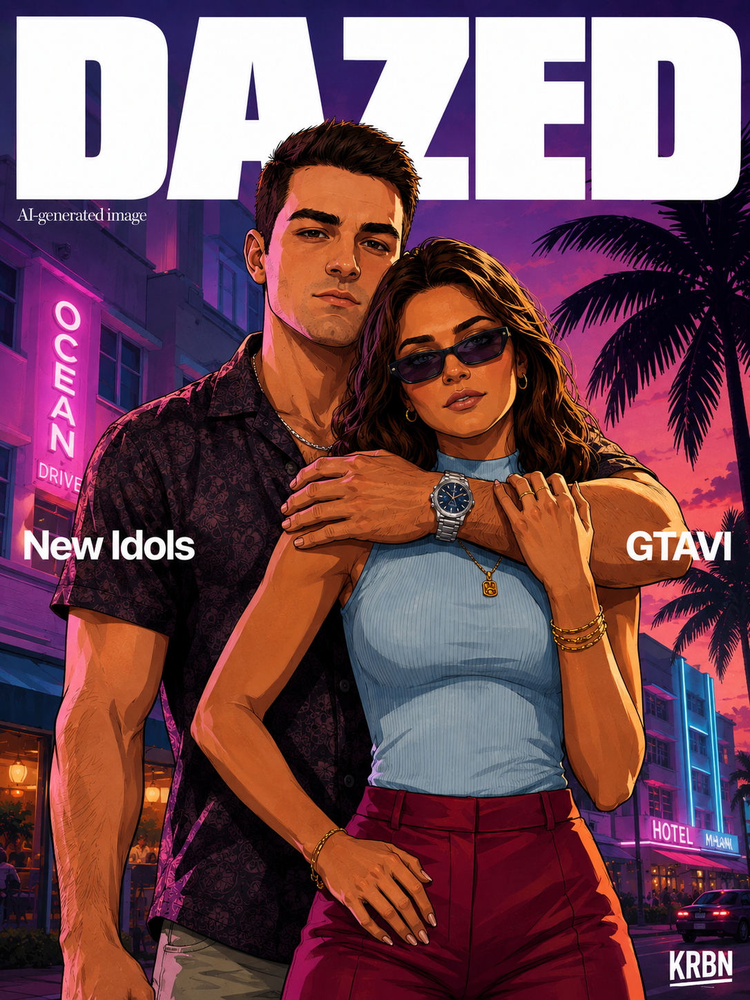

## 1. Resumen

Hay lanzamientos capaces de imponer una estética mucho antes de llegar a nuestras manos. **GTA VI** es uno de ellos. Rockstar ha devuelto el foco a Vice City y al estado ficticio de Leonida, con Jason y Lucia como protagonistas de una historia marcada por el crimen, el neón y una versión contemporánea de Florida. Actualmente, su lanzamiento está anunciado para el **19 de noviembre de 2026** en PlayStation 5 y Xbox Series X|S, según la [web oficial de Rockstar Games](https://www.rockstargames.com/VI).

Con semejante expectación, es normal encontrar en redes sociales todo tipo de *edits*: retratos personales convertidos en arte promocional, falsos pósteres, portadas de revistas y escenas coloreadas con violetas, magentas y naranjas. La combinación funciona especialmente bien porque mezcla dos lenguajes visuales reconocibles: la ilustración cinematográfica de un videojuego y la composición tipográfica de una revista de moda.

En este artículo comparto una plantilla pensada para generar precisamente ese resultado: una portada vertical protagonizada por dos personas, con sus identidades, alturas y posiciones definidas por ti. El objetivo no es copiar una captura del juego, sino crear una pieza original que evoque ese universo de palmeras, Art Déco y luz de neón.

> **Nota:** utiliza fotografías propias o imágenes para las que tengas permiso. Si aparece otra persona, pide su consentimiento antes de subir su rostro a un servicio de generación de imágenes o publicar el resultado.

## 2. El resultado que buscamos



La clave está en pedir una **ilustración real**, no una fotografía procesada con un filtro. Por eso la plantilla insiste en los contornos dibujados, el sombreado tipo *cel shading*, las sombras angulares y una textura pictórica controlada. También establece prioridades para evitar algunos fallos frecuentes: rostros mezclados, alturas idénticas, manos imposibles o una persona que tapa por completo a la otra.

## 3. Qué necesitas

Antes de copiar el prompt, prepara:

1. **Dos fotografías de referencia**, una para la persona A y otra para la persona B.
2. Imágenes nítidas, bien iluminadas y con la cara visible, preferiblemente tomadas de frente o en un ángulo de tres cuartos.
3. La **altura real** de ambas personas en centímetros.
4. Una decisión sobre quién estará delante y quién detrás.
5. Una lista breve de detalles que no aparezcan en las fotos o que quieras modificar: ropa, peinado, reloj, gafas, expresión, etc.

Si puedes adjuntar varias fotos por persona, elige referencias coherentes entre sí. Una imagen frontal ayuda a conservar el rostro; otra puede aclarar el peinado, la complexión o un accesorio. Evita fotos con filtros intensos, poca resolución, gafas que oculten los ojos o iluminación que transforme demasiado la cara.

## 4. Cómo rellenar la plantilla

Sustituye todos los campos escritos entre corchetes:

| Campo | Qué debes escribir | Ejemplo |
|---|---|---|
| `[HEIGHT_A]` | Altura de la persona A en centímetros | `178` |
| `[HEIGHT_B]` | Altura de la persona B en centímetros | `170` |
| `[FRONT / BACK]` | `FRONT` si está delante; `BACK` si está detrás | `BACK` |
| `[PERSON_A]` | Nombre, letra o descripción inequívoca de la primera persona | `Person A` |
| `[PERSON_B]` | Nombre, letra o descripción inequívoca de la segunda persona | `Person B` |
| `[INSTRUCTIONS_A]` | Cambios o detalles exclusivos de A | `Keep his silver watch with a navy-blue dial.` |
| `[INSTRUCTIONS_B]` | Cambios o detalles exclusivos de B | `Wear her hair loose, shoulder length.` |

Las posiciones deben ser coherentes: si A es `BACK`, B tiene que ser `FRONT`, y las líneas de composición deben repetir esa misma relación. Es mejor escribir `Person A stands slightly behind Person B` que utilizar pronombres ambiguos.

La diferencia de altura también debe expresarse con números reales. Si una persona mide 178 cm y la otra 170 cm, son **8 cm de diferencia**: no pidas simplemente que una sea “mucho más alta”. La plantilla obliga al modelo a reflejarla mediante la coronilla, los ojos, los hombros y las proporciones corporales.

En las instrucciones adicionales, sé concreto y breve. Incluye únicamente lo que de verdad quieras cambiar o proteger. Por ejemplo:

- `Person A: black short-sleeve shirt; preserve his beard and silver wristwatch.`
- `Person B: loose shoulder-length hair; no sunglasses.`
- `Person A: keep the small scar over his right eyebrow.`

## 5. Prompt completo

Copia el siguiente bloque, reemplaza los marcadores y adjunta las dos imágenes en el mismo mensaje que envíes al generador:

```text
Create a vertical illustrated magazine-cover portrait using the TWO supplied reference photos as strict identity references.

SUBJECTS
- Person A: use reference image A. Height: [HEIGHT_A] cm. Position: [FRONT / BACK].
- Person B: use reference image B. Height: [HEIGHT_B] cm. Position: [FRONT / BACK].

IDENTITY PRESERVATION
Preserve each person's recognizable facial identity from their respective reference image:
- face shape and proportions
- eyes and eyebrows
- nose
- mouth and jawline
- natural skin tone
- distinctive facial features
- hair color and general hairline

Do NOT blend the two identities together.
Do NOT beautify them into generic models.
They must remain clearly recognizable as the two people in the reference photos, translated into an illustrated videogame/comic style.

HEIGHT AND BODY PROPORTIONS
Person A is [HEIGHT_A] cm tall.
Person B is [HEIGHT_B] cm tall.
Represent their height difference realistically when standing on the same ground plane.

Their eye level, shoulders, head height and body proportions must reflect the stated difference in height.
Do not make both subjects the same height for compositional convenience.

COMPOSITION
[PERSON_A] stands slightly behind [PERSON_B].

The person behind affectionately embraces the person in front from behind/side, placing one arm naturally across the upper chest/shoulders.

Both look toward the camera.

Create a confident, relaxed editorial pose similar to a stylish videogame promotional artwork.

Frame them approximately from the upper thighs/hips upward.

The person in front should remain clearly visible and should not be excessively covered by the person behind.

STYLE
Highly illustrated, NOT photorealistic.

Premium modern videogame key-art / graphic-novel aesthetic:
- clearly visible hand-drawn contour lines
- strong ink-like outlines around faces, hair, clothing and arms
- cel-shaded lighting
- simplified painted skin shading
- angular shadow shapes
- subtle brush texture
- crisp illustrated hair strands
- controlled facial detail
- slightly exaggerated cinematic proportions
- polished digital illustration
- realistic anatomy underneath the stylization

The result should look like professionally drawn videogame promotional artwork rather than a photograph with a filter.

Avoid:
photorealism, photographic skin texture, pores, camera noise, hyperrealistic rendering, plastic 3D appearance, anime proportions, caricature, overly smooth AI faces.

COLOR AND LIGHTING
Use a dramatic Miami-inspired sunset palette:
deep violet, purple, magenta, hot pink, orange and subtle cyan/teal highlights.

Warm sunset key light from one side.
Pink/purple neon rim light from the opposite side.
Strong but tasteful illustrated contrast.

BACKGROUND
Nightfall / sunset Miami-inspired Art Deco boulevard.

Include:
- palm trees
- Art Deco hotel façades
- neon signs
- warm illuminated windows
- deep purple/pink/orange sunset sky
- subtle street activity
- cinematic depth

The background should remain detailed but secondary to the two characters.

MAGAZINE COVER DESIGN
Vertical 3:4 composition.

At the very top place an enormous bold white masthead:
"DAZED"

The characters may partially overlap the lower portion of the masthead to create an editorial magazine-cover effect.

Small text beneath the masthead:
"AI-generated image"

Left-side cover line:
"New Idols"

Right-side cover line:
"GTAVI"

Bottom-right signature/logo:
"KRBN"

Use clean white typography.
Keep all text correctly spelled and readable.

IMPORTANT
The priority order is:
1. Preserve the identities of both reference people.
2. Respect their specified height difference.
3. Respect which person is in front and which is behind.
4. Maintain anatomically believable interaction and hands.
5. Reproduce the strongly illustrated videogame/comic aesthetic.
6. Preserve the magazine-cover composition.

Do not change a person's hairstyle, facial hair, accessories or other defining characteristics unless explicitly instructed below.

ADDITIONAL CHARACTER INSTRUCTIONS:
Person A: [INSTRUCTIONS_A]
Person B: [INSTRUCTIONS_B]
```

## 6. Ejemplo rellenado

Imaginemos que la persona A mide 178 cm, estará detrás y debe conservar un reloj de acero con esfera azul marino. La persona B mide 170 cm, estará delante y queremos que lleve el pelo suelto hasta los hombros. Las líneas variables quedarían así:

```text
SUBJECTS
- Person A: use reference image A. Height: 178 cm. Position: BACK.
- Person B: use reference image B. Height: 170 cm. Position: FRONT.

COMPOSITION
Person A stands slightly behind Person B.

ADDITIONAL CHARACTER INSTRUCTIONS:
Person A: Preserve his silver stainless-steel dive watch with a dark navy-blue dial.
Person B: Wear her hair loose, approximately shoulder length.
```

## 7. Cómo mejorar una primera generación

No intentes corregir diez cosas a la vez. Genera una primera versión, identifica el error dominante y formula una edición localizada. Algunos mensajes útiles serían:

- **Si parece demasiado realista:** `Make the entire image more strongly illustrated. Add clearly visible ink contours and angular cel-shaded shadows. Remove photographic skin texture.`
- **Si las caras se mezclan:** `Restore Person A strictly from reference A and Person B strictly from reference B. Do not transfer facial features between them.`
- **Si ignora las alturas:** `Keep both people on the same ground plane and correct their head, eye and shoulder levels to represent exactly an 8 cm height difference.`
- **Si falla la mano del abrazo:** `Redraw only the embracing arm and hand with natural anatomy, five visible fingers where appropriate and a believable shoulder connection.`
- **Si el texto sale mal:** genera primero la ilustración y añade la tipografía después con un editor gráfico. Los modelos de imagen todavía pueden deformar letras pequeñas aunque el prompt pida texto legible.

También conviene mantener la misma conversación durante las correcciones para que el generador conserve la composición y las referencias. Cuando una versión esté cerca del resultado deseado, pide cambios precisos —“solo el peinado”, “solo el reloj”, “más líneas dibujadas”— en lugar de volver a generar desde cero.

La plantilla es deliberadamente extensa porque separa identidad, anatomía, composición, estilo y tipografía. Esa estructura facilita detectar qué parte ha fallado y corregirla sin perder lo que ya funciona. Una vez rellenados los siete marcadores, solo queda adjuntar las referencias, generar la primera versión y afinarla detalle a detalle.